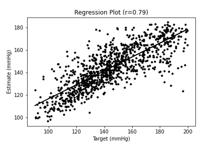
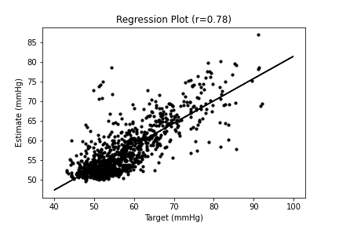

# Blood Pressure Estimation using PPG Signal Morphological Features

This repository contains the codes corresponding to study continous blood pressure estimation using PPG features.

## Requirements
Please install the following Python (3.8) libraries:

- hrv-analysis
- biosppy
- pyampd
- scipy
- mat73
- sklearn
- pandas
- numpy
- matplotlib

## Usage
 You can skip steps 1,2, and 3 and use the pre-extracted features.csv.
 
 1- Download [MIMIC II dataset](https://archive.physionet.org/mimic2/ ) (BP, ECG, PPG) and save as MATLAB matrices in "data" folder. (similar to [UCI BP dataset](https://archive.ics.uci.edu/ml/datasets/Cuff-Less+Blood+Pressure+Estimation))
 
 2- Run featureExtractor.py
 
 3- Run CSVconcat.py to concat CSV feature files created by the previous step.
 
 4- Run BPEstimation.py to fit and test machine learning based models.

## Plots
The results of BP estimation using Random Forest model (10-fold corss validation):

**Systolic BP**: corr=0.79, MAE=11.12 mmHg, STD=9.96 mmHg

**Diastolic BP**: corr=0.78, MAE=4.06 mmHg, STD=3.95 mmHg





## Citing this work
Please use the following citation:
```
Hasanzadeh, Navid, Mohammad Mahdi Ahmadi, and Hoda Mohammadzade. "Blood pressure estimation using photoplethysmogram signal and its morphological features." IEEE Sensors Journal 20, no. 8 (2019): 4300-4310.
```
